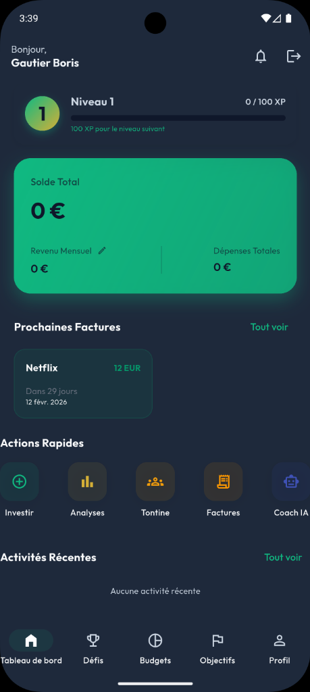

# Kauri Website

Kauri is a smart financial management platform that combines the power of AI and the solidarity of Tontines to offer total financial freedom.



## 🌟 Key Features

- **Tontines 2.0**: Securely create and manage tontines with fixed or random rotation, AI-verified payments, and total transparency.
- **AI Financial Coach**: A personal assistant that analyzes spending, detects subscriptions, and provides 24/7 financial advice.
- **Smart Capture**: Log expenses via OCR receipt scanning, voice commands, or automatic bank/Mobile Money SMS import.
- **Smart Budgeting & Goals**: Adaptive, shareable budgets and savings goals with real-time alerts and round-up savings.
- **Bank-Grade Security**: AES-256 encryption, KYC identity verification, and real-time fraud monitoring.
- **Gamification**: Earn badges and reach new levels by hitting your financial goals and challenges.
- **Multi-Currency**: Effortlessly manage finances in XAF, EUR, and USD with real-time conversion.
- **Shared Subscriptions (Reseller Hub)**: Split or resell premium subscriptions (Netflix, Spotify, Canva...) within the Kauri community.

## 🚀 Tech Stack

- **Frontend**: HTML5, Vanilla CSS, Javascript (ES6+)
- **Internationalization**: Custom i18n implementation (French & English)
- **Features**: Progressive Web App (PWA) support, intersection observers for animations, responsive design.

## 📂 Project Structure

```text
├── index.html          # Main landing page
├── styles.css         # Styling and design system
├── scripts.js        # Core logic and internationalization
├── manifest.json      # PWA manifest
├── privacy.html      # Privacy Policy
├── terms.html        # Terms of Service
└── assets/           # Images and brand identity
```

## 🛠️ Local Development

1. **Clone the repository**:
   ```bash
   git clone https://github.com/TheGoatIA/kauri-website.git
   ```
2. **Open in Browser**:
   Simply open `index.html` in your preferred web browser or use a local development server like VS Code Live Server.

## 🌍 Languages

The website currently supports:
- 🇫🇷 Français
- 🇺🇸 English

## 📄 License

This project is licensed under the MIT License - see the [LICENSE](LICENSE) file for details.

## 📧 Contact

For any inquiries, reach us at:  
**Email**: infos@kauri-app.com  
**Location**: Service Kauri, Douala, Cameroon.
